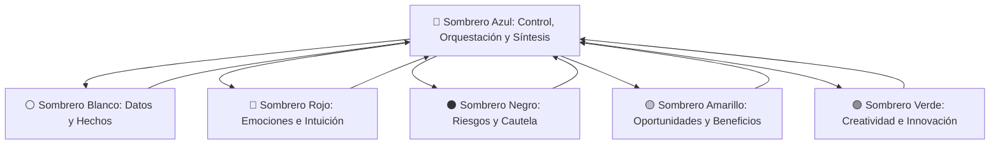

# Marco de Trabajo: Metodología de los Seis Sombreros para Pensar (Edward de Bono)

Este espacio de trabajo está diseñado para la deliberación estratégica, la toma de decisiones complejas, el análisis multifactorial y la resolución de problemas mediante la técnica sistemática de los **Seis Sombreros para Pensar** (*Six Thinking Hats*), integrando rigor forense, creatividad y análisis de riesgos.

---

## Estructura de los Seis Sombreros

### 1. ⚪ Sombrero Blanco (Objetividad y Evidencia)
- **Foco:** Datos duros, cifras cuantitativas, documentos verificados, registros oficiales y lagunas de información.
- **Preguntas guía:** ¿Qué información fehaciente tenemos? ¿Qué datos nos faltan? ¿Cómo los conseguimos de manera fidedigna?
- **Prohibición:** Cero especulaciones, juicios de valor o interpretaciones sesgadas.

### 2. 🔴 Sombrero Rojo (Emoción e Intuición)
- **Foco:** Sentimientos, corazonadas, reacciones viscerales del público o stakeholders, tono emocional y clima de opinión.
- **Preguntas guía:** ¿Qué me dice el instinto ante esta situación? ¿Cómo reaccionará emocionalmente la comunidad o la contraparte?
- **Premisa:** No requiere justificación racional ni lógica probatoria.

### 3. ⚫ Sombrero Negro (Juicio Crítico y Cautela)
- **Foco:** Identificación de riesgos, vulnerabilidades jurídicas o éticas, posibles fallos, escenarios adversos y costos ocultos.
- **Preguntas guía:** ¿Por qué podría fallar esta iniciativa? ¿Qué riesgos legales, penales o reputacionales corremos? ¿Dónde están los puntos ciegos?
- **Premisa:** Crítica constructiva e implacable basada en el principio de precaución.

### 4. 🟡 Sombrero Amarillo (Optimismo Constructivo y Valor)
- **Foco:** Beneficios, oportunidades, ventajas comparativas, rentabilidad social o institucional y viabilidad positiva.
- **Preguntas guía:** ¿Cuáles son las mayores fortalezas de esta idea? ¿Cuál es el impacto positivo más ambicioso alcanzable?
- **Premisa:** Optimismo fundamentado en razones lógicas de viabilidad.

### 5. 🟢 Sombrero Verde (Creatividad y Pensamiento Lateral)
- **Foco:** Alternativas disruptivas, hipótesis audaces, caminos no explorados y superación de obstáculos mediante ingenio.
- **Preguntas guía:** ¿Qué enfoque totalmente diferente no se ha intentado? ¿Cómo podemos transformar un obstáculo en una ventaja?
- **Premisa:** Libertad creativa sin juzgar la viabilidad de forma prematura.

### 6. 🔵 Sombrero Azul (Control Metacognitivo y Síntesis)
- **Foco:** Gestión de la agenda de deliberación, selección del sombrero activo, balanceo del debate y compilación del plan de acción final.
- **Preguntas guía:** ¿Qué sombrero corresponde utilizar ahora? ¿Cuál es la conclusión ejecutiva tras recorrer las distintas perspectivas?

---

## Protocolo Operativo del Agente en SIX HATS

1. **Activación de Pensamiento Secuencial:** Se utiliza el servidor MCP `sequential-thinking` para registrar los pasos reflexivos y alternar metódicamente entre perspectivas.
2. **Registro de Rondas:** En cada sesión o problema planteado, se documentarán las intervenciones identificando explícitamente el sombrero activo (`[⚪ Blanco]`, `[⚫ Negro]`, `[🟢 Verde]`, etc.).
3. **Regla de Cierre:** Toda deliberación concluye obligatoriamente bajo el **Sombrero Azul** con un dictamen de síntesis, matriz de riesgos mitigados y hoja de ruta con próximos pasos concretos.
