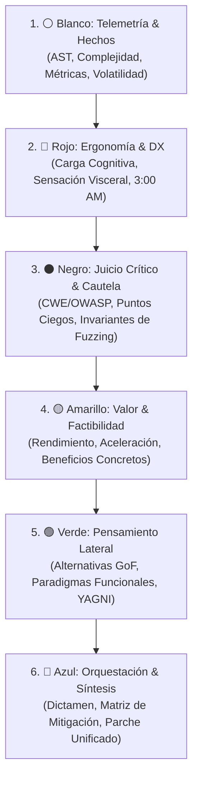

# Habilidad: Deliberación de Seis Sombreros para Pensar (Six Hats)

Esta habilidad proporciona una metodología estructurada de pensamiento paralelo para analizar decisiones técnicas complejas, revisar código de forma multifacética, diseñar arquitecturas robustas y auditar la sobreingeniería en el software.

---

## Cuándo activar esta habilidad

Activa esta habilidad cuando el usuario o la tarea involucre:
1. **Revisiones de código o Pull Requests críticos:** Necesidad de evaluar no solo la sintaxis, sino la seguridad, la ergonomía y la mantenibilidad.
2. **Decisiones arquitectónicas complejas:** Selección entre patrones, migraciones de infraestructura o adopción de nuevas tecnologías con trade-offs significativos.
3. **Auditorías contra la sobreingeniería (Filtro Ponytail):** Detección de abstracciones innecesarias, microservicios prematuros o violaciones a la Escalera de la Pereza.
4. **Validación de robustez e invariantes:** Diseño de pruebas basadas en propiedades (Hypothesis) y análisis de vulnerabilidades OWASP/CWE.

---

## Catálogo de Herramientas MCP Disponibles

El servidor MCP `six-hats` expone cuatro herramientas nativas:

| Herramienta | Propósito Principal | Cuándo Utilizarla |
| :--- | :--- | :--- |
| `six_hats_review` | Ciclo completo de deliberación de los 6 sombreros con dictamen Azul. | Auditorías profundas de archivos o parches complejos. |
| `six_hats_quick_check` | Tríada rápida de Hechos (Blanco), Riesgos (Negro) y Valor (Amarillo). | Comprobaciones ágiles durante refactorizaciones continuas. |
| `six_hats_debate` | Confrontación dialéctica directa entre dos sombreros opuestos. | Desempate entre innovación (Verde) y prudencia/costos (Negro). |
| `six_hats_ponytail_audit` | Auditoría estricta de sobreingeniería y cálculo de Bloat Score. | Detección de boilerplate, jerarquías infladas y patrones innecesarios. |

---

## Protocolo de Razonamiento Paso a Paso



### Paso 1: ⚪ Sombrero Blanco (Objetividad pura)
- Recopila datos cuantitativos duros: complejidad ciclomática de McCabe, complejidad cognitiva de Sonar, líneas modificadas y dependencias directas.
- Si existe `graphify-out/graph.json` en el repositorio, absorbe los *god nodes* y métricas de modularidad.
- **Prohibición:** Cero juicios de valor o especulaciones.

### Paso 2: 🔴 Sombrero Rojo (Intuición y Ergonomía DX)
- Evalúa el código bajo la regla de las **3:00 AM**: ¿Es legible bajo estrés o fatiga?
- Detecta ruido visual y colisiones léxicas de variables (variables con nombres casi idénticos).
- Aplica el filtro visceral: ¿Huele a sobreingeniería?

### Paso 3: ⚫ Sombrero Negro (Seguridad y Juicio Crítico)
- Identifica fallos lógicos, vulnerabilidades de inyección, riesgos de concurrencia y ausencia de validación defensiva.
- Formula invariantes de prueba basadas en propiedades para Hypothesis:
  - Fuzzing de cadenas (Unicode, RTL, secuencias nulas).
  - Fuzzing numérico (enteros extremos, NaN, desbordamientos).
  - Idempotencia y liberación determinista de recursos.

### Paso 4: 🟡 Sombrero Amarillo (Optimismo y Valor)
- Destaca el valor comercial y técnico de la solución: ganancia de throughput, reducción de latencia o aceleración de entrega.
- Valora la modernización idiomática del lenguaje (ej. patrones de Python 3.10+ o TypeScript estricto).

### Paso 5: 🟢 Sombrero Verde (Creatividad y Alternativas)
- Propone al menos dos alternativas radicales:
  - Una arquitectura funcional/inmutable (ej. Result monads o Railway-Oriented Programming).
  - Una simplificación extrema aplicando YAGNI radical.

### Paso 6: 🔵 Sombrero Azul (Control y Veredicto)
- Compila la deliberación en un veredicto formal:
  - `APPROVE`: Si el código es robusto y cumple con el estándar de simplicidad.
  - `CONDITIONAL`: Si requiere la aplicación de parches o mitigaciones específicas.
  - `REJECT`: Si introduce vulnerabilidades de severidad CRITICAL o sobreingeniería no justificada.
- Si corresponde, emite el parche de remediación en formato Unified Diff.

---

## Ejecución vía CLI

Puedes ejecutar `six-hats` directamente desde la terminal del sistema:
```bash
# Revisión completa con exportación HTML y SARIF
six-hats review ruta/al/archivo.py --html reporte.html --sarif reporte.sarif

# Revisión de cambios no confirmados en Git
six-hats review --git-diff --html diff.html

# Auditoría estricta contra la Escalera de la Pereza
six-hats ponytail ruta/al/archivo.py --threshold 20.0
```
